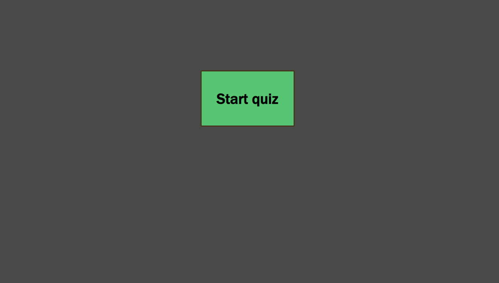
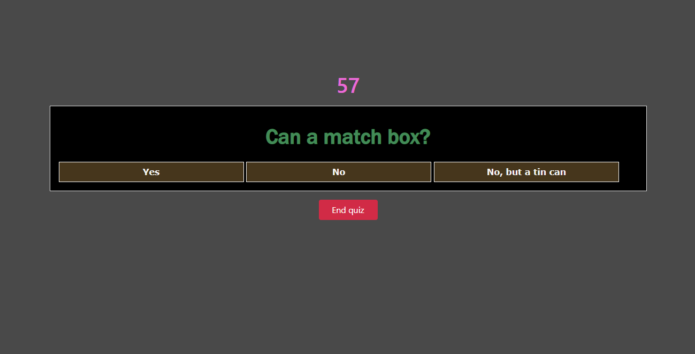
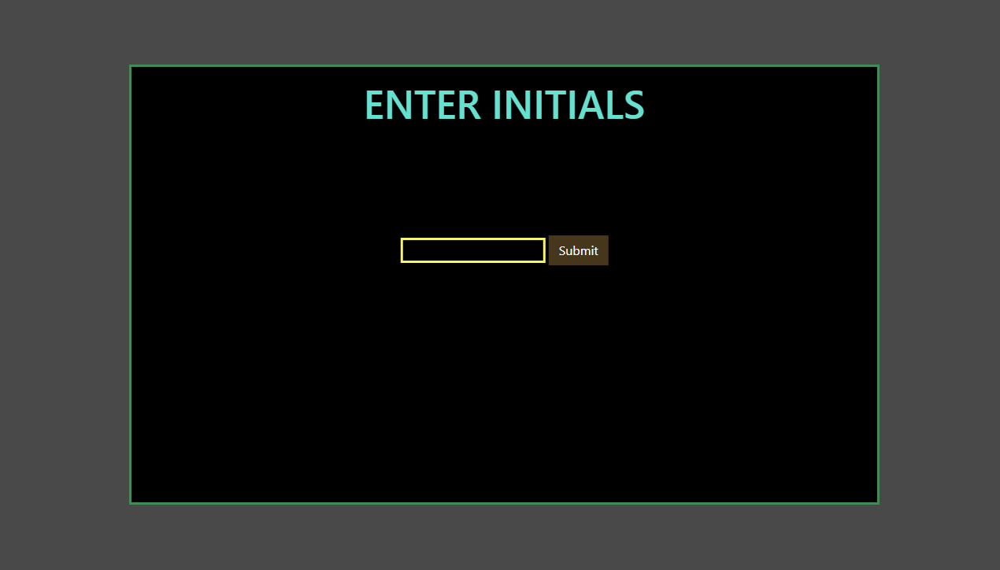
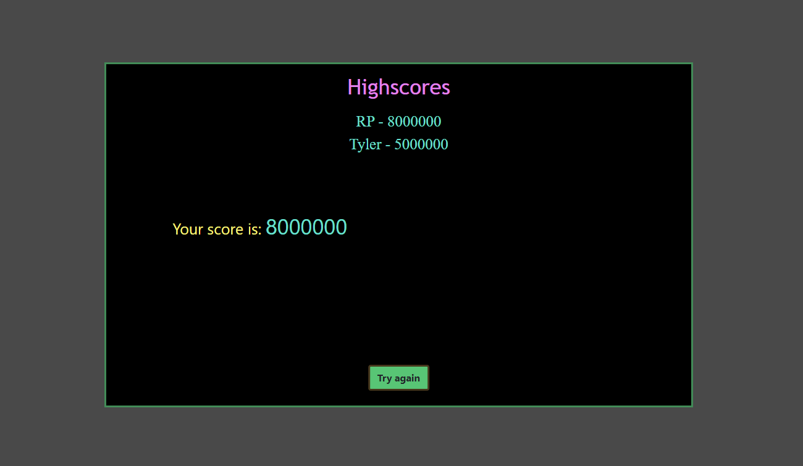

# Code-Quiz

The best code-quiz ever.
A "start quiz" button appears. Once pressed, a 60 second timer begins and a series of questions appear everytime you click an answer.
For every wrong answer, you are deducted 10 seconds.
Once either all questions have been answer or the timer reaches 0, you're asked to enter your initials. Then you will see your score
and the highscores!

https://tylerpetri.github.io/Code-Quiz/

